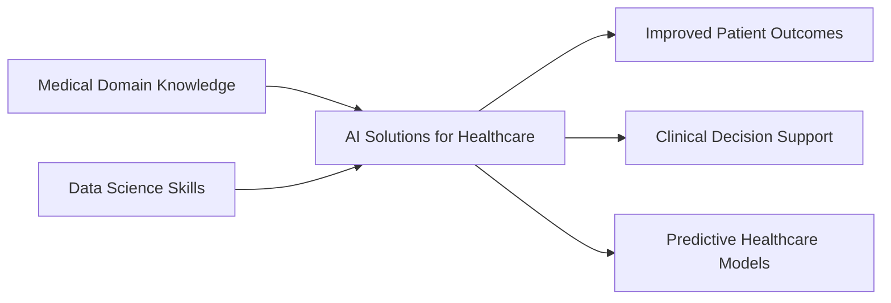

  
# 👨‍⚕️💻 From Surgery to Data Science
  

  

  
  
  
  
  
  

 

  
  

---

## 🎯 Mission Statement

> **"Transforming clinical insights into data-driven solutions that save lives"**

### 🩺 Who Am I?

I'm a **Data Scientist** with the unique perspective of an **8-year experienced Surgeon**. My journey from the operating room to the world of algorithms gives me an unparalleled understanding of both medical complexities and data science capabilities.

### 🚀 What Makes Me Different?

- **🏥 Deep Medical Domain Expertise**: 8+ years handling EMR, CT, MRI, and biosignal data in real clinical settings
- **📊 Proven Research Excellence**: Published as first author in SCI-indexed 'Journal of Trauma and Injury'
- **🏆 Award-Winning Performance**: Recognized as 'Best Resident' at Wonju Severance Christian Hospital
- **💡 Bridge Between Worlds**: Uniquely positioned to translate clinical needs into AI solutions

---

## 🛠️ Tech Stack & Tools

### 💻 Programming & Data Science

### 📊 Data Analysis & Visualization

### 🤖 Machine Learning & Deep Learning

### 🏥 Medical Data & Imaging

### 🔧 Tools & Platforms

---

## 📈 GitHub Analytics

  
  

  

  

---

## 🏆 Key Achievements

| 🎯 Achievement | 📅 Year | 🏢 Organization |
|:---:|:---:|:---:|
| **Best Resident Award** | 2023 | Wonju Severance Christian Hospital |
| **SCI Paper First Author** | 2022 | Journal of Trauma and Injury |
| **Year-Dream School 5th** | 2025 | Data Science Program |
| **Clinical Excellence** | 2017-2025 | 8 Years as Surgeon |

---

## 🔬 Featured Projects

### 🏥 Medical AI Projects
  

### 📊 Data Science Competitions

---

## 📚 Latest Research & Publications

### 📄 Published Papers
- **[2020]** "Pitfalls, Complications, and Necessity of Education about REBOA: A Single Regional Trauma Center Study" - *Journal of Trauma and Injury* (SCI, First Author)

### 🎤 Conferences & Presentations
- **[2025]** Year-Dream School Data Science Showcase - Team Project Leader

---

## 🌱 Current Focus

### 🎯 2025 Goals
- [ ] Complete Year-Dream School Data Science Program
- [ ] Contribute to open-source medical AI projects
- [ ] Build production-ready healthcare ML models

---

## 💬 Let's Connect!

I'm always interested in collaborating on projects that combine **medical expertise** with **data science** to create meaningful impact in healthcare.

### 🤝 Open to:
- Medical AI Research Collaborations
- Healthcare Data Science Projects
- Clinical Decision Support Systems
- Medical Image Analysis Projects

---

  
### 💡 Random Dev Quote
  

  

