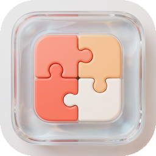

 

### Surgeon &rarr; Stay-at-Home Dad &rarr; App Store #1

I spent 8 years as a surgeon. After my daughter was born, I left medicine to be a full-time dad. 
With zero coding experience, I built **3 apps using AI** &mdash; and one hit **#1 on the App Store**.

 

`Now writing a book about it.`

 

<table>
<tr>
<td align="center" width="260">

 

**Pieceful**

AI baby journal &mdash; 3-second capture from lock screen

</td>
<td align="center" width="260">

 

**Byeolmal**

Capture your child's voice &mdash; AI empathy responses

</td>
<td align="center" width="260">

 

**Kindergarten Finder**

Location-based kindergarten & daycare search

</td>
</tr>
</table>

 

| | |
|:--|:--|
| **Award** | Minister's Prize for AI Talent &mdash; Ministry of SMEs and Startups |
| **Book** | *Vibe Coding: From Claude Code to the App Store* &mdash; Gilbut Publishers (2026) |
| **Featured** | [**yozm interview** &mdash; "From parenting to vibe coding to #1"](https://yozm.wishket.com/magazine/detail/3613/) |
| **Education** | Yonsei Univ. College of Medicine (MD) &middot; Meta Llama Academy &middot; Yeardream School |

 

 

 

  

 

